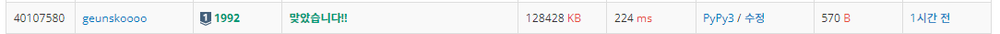

# 1997번: 쿼드트리

* [백준(boj) 1997번](https://www.acmicpc.net/problem/1997)


## 문제

흑백 영상을 압축하여 표현하는 데이터 구조로 쿼드 트리(Quad Tree)라는 방법이 있다. 흰 점을 나타내는 0과 검은 점을 나타내는 1로만 이루어진 영상(2차원 배열)에서 같은 숫자의 점들이 한 곳에 많이 몰려있으면, 쿼드 트리에서는 이를 압축하여 간단히 표현할 수 있다.

주어진 영상이 모두 0으로만 되어 있으면 압축 결과는 "0"이 되고, 모두 1로만 되어 있으면 압축 결과는 "1"이 된다. 만약 0과 1이 섞여 있으면 전체를 한 번에 나타내지를 못하고, 왼쪽 위, 오른쪽 위, 왼쪽 아래, 오른쪽 아래, 이렇게 4개의 영상으로 나누어 압축하게 되며, 이 4개의 영역을 압축한 결과를 차례대로 괄호 안에 묶어서 표현한다.


위 그림에서 왼쪽의 영상은 오른쪽의 배열과 같이 숫자로 주어지며, 이 영상을 쿼드 트리 구조를 이용하여 압축하면 "`(0(0011)(0(0111)01)1)`"로 표현된다. N ×N 크기의 영상이 주어질 때, 이 영상을 압축한 결과를 출력하는 프로그램을 작성하시오.

<br/>

## 입력 조건

첫째 줄에는 영상의 크기를 나타내는 숫자 N 이 주어진다. N 은 언제나 2의 제곱수로 주어지며, 1 ≤ N ≤ 64의 범위를 가진다. 두 번째 줄부터는 길이 N의 문자열이 N개 들어온다. 각 문자열은 0 또는 1의 숫자로 이루어져 있으며, 영상의 각 점들을 나타낸다.

<br/>

## 출력 조건

영상을 압축한 결과를 출력한다.

<br/>

> **첫 번째 시도 .**

```python
n = int(input())

# video 화면 받기.
video = []
for i in range(n):
  video.append(list(map(int,input())))
size = n

#분할 정복 구현
def conquer(x,y,n):
  color = video[x][y]
  for i in range(x,x+n):
    for j in range(y,y+n):
      if video[i][j] != color:
        print('(',end='')
        conquer(x,y,n // 2)
        conquer(x,y + n // 2,n // 2)
        conquer(x + n // 2 ,y, n // 2)
        conquer(x + n // 2, y + n // 2, n // 2)
        print(')',end='')
        return
  
  if color == 1:
    print(1,end='')
  else:
    print(0,end='')
  
conquer(0,0,n)
```

 ***>>intput***

```python
8
11110000
11110000
00011100
00011100
11110000
11110000
11110011
11110011
```

 ***>>output***

```python
((110(0101))(0010)1(0001))
```

***success***



<br/>

## 🌝 Thinking

[[백준] [python] 2630번: 색종이 만들기](https://geunskoo.github.io/알고리즘/boj-2630/)  비슷한 분할 정복 문제.

**[아이디어]**

1. 구간안의 video가 0 또는 1로 통일이 되어 있지 않으면 4분할을 하여 다시 재탐색한다. (원리 설명 위의 링크참조)

2. **'(' 여는 괄호** 는 분할이라는 과정이 시작되면 출력해준다. 분할을 하기위한 조건문 바로 아래에 위치하면 된다.

3. **')' 닫는 괄호** 는 4분할을 할 때 같이 분할 되었던 conquer 함수들이 모두 복귀완료 되었을때 닫아주어야한다.

   4개의 재귀 호출 함수 아래에 위치시켜주면 된다.

***

<br/>

<br/>

## 💡 깨달은 점.

1. 분할 정복이라는 알고리즘은 재귀적으로 여러함수를 호출하게 된다. 각각 재귀적인 수행을 다하고 돌아오는 시점이

   언제인지 괄호를 통하여 이해할 수 있었다.
