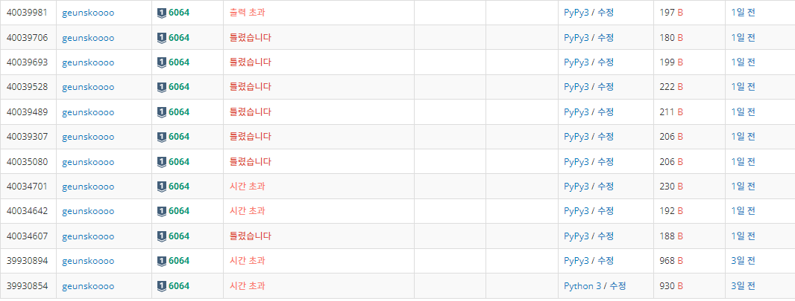

# 6064번: 카잉 달력

* [백준(boj) 6064번](https://www.acmicpc.net/problem/6064)


## 문제

최근에 ICPC 탐사대는 남아메리카의 잉카 제국이 놀라운 문명을 지닌 카잉 제국을 토대로 하여 세워졌다는 사실을 발견했다. 카잉 제국의 백성들은 특이한 달력을 사용한 것으로 알려져 있다. 그들은 M과 N보다 작거나 같은 두 개의 자연수 x, y를 가지고 각 년도를 <x:y>와 같은 형식으로 표현하였다. 그들은 이 세상의 시초에 해당하는 첫 번째 해를 <1:1>로 표현하고, 두 번째 해를 <2:2>로 표현하였다. <x:y>의 다음 해를 표현한 것을 <x':y'>이라고 하자. 만일 x < M 이면 x' = x + 1이고, 그렇지 않으면 x' = 1이다. 같은 방식으로 만일 y < N이면 y' = y + 1이고, 그렇지 않으면 y' = 1이다. <M:N>은 그들 달력의 마지막 해로서, 이 해에 세상의 종말이 도래한다는 예언이 전해 온다. 

예를 들어, M = 10 이고 N = 12라고 하자. 첫 번째 해는 <1:1>로 표현되고, 11번째 해는 <1:11>로 표현된다. <3:1>은 13번째 해를 나타내고, <10:12>는 마지막인 60번째 해를 나타낸다. 

네 개의 정수 M, N, x와 y가 주어질 때, <M:N>이 카잉 달력의 마지막 해라고 하면 <x:y>는 몇 번째 해를 나타내는지 구하는 프로그램을 작성하라. 

<br/>

## 입력 조건

입력 데이터는 표준 입력을 사용한다. 입력은 T개의 테스트 데이터로 구성된다. 

입력의 첫 번째 줄에는 입력 데이터의 수를 나타내는 정수 T가 주어진다. 

각 테스트 데이터는 한 줄로 구성된다. 

각 줄에는 네 개의 정수 M, N, x와 y가 주어진다. 

(1 ≤ M, N ≤ 40,000, 1 ≤ x ≤ M, 1 ≤ y ≤ N) 여기서 <M:N>은 카잉 달력의 마지막 해를 나타낸다.

<br/>

## 출력 조건

출력은 표준 출력을 사용한다.

 각 테스트 데이터에 대해, 정수 k를 한 줄에 출력한다.

 여기서 k는 <x:y>가 k번째 해를 나타내는 것을 의미한다. 

만일 <x:y>에 의해 표현되는 해가 없다면, 즉, <x:y>가 유효하지 않은 표현이면, -1을 출력한다.

<br/>

> **첫 번째 시도 .**

```python
#Logic Error 
import sys
input = sys.stdin.readline
T = int(input())

for _ in range(T):
  m,n,x,y = map(int,input().split())
  for i in range(n*m+1):
    if (m * i + x) % n == y:
      print(m * i + x)
      break
  if i == n*m:
    print(-1)
    
#time Error
def coprime(a,b):
    while (b!=0):
        temp = a%b
        a = temp
        a,b=b,a
    return a

t = int(input())

for i in range(t):
    nx=1
    ny=1
    count=1
    m,n,x,y = map(int,input().split())
    if coprime(abs(m-n),abs(x-y)) != 1:
        while True:
            if nx == m+1:
                nx=1
            if ny == n+1:
                ny=1
            if nx==x and ny==y:
                break
            else:
                nx+=1
                ny+=1
            count += 1
        print(count)
    else:
        if abs(m-n)==1 or abs(x-y)==1:
            while True:
                if nx == m+1:
                     nx=1
                if ny == n+1:
                     ny=1
                if nx==x and ny==y:
                    break
                else:
                    nx+=1
                    ny+=1
                count += 1
            print(count)
        else:
            print(-1)
```

 ***>>intput***

```python
3
10 12 3 9
10 12 7 2
13 11 5 6
```

 ***>>output***

```python
33
-1
83
```

 ***fail(시간 초과  + Logic Error)***



<br/>

하하하.... 내 멘탈

## 🌝 Thinking

**[아이디어]**

Time Error 가 난 코드는 그리디 알고리즘처럼 그냥 원하는 것을 탐하며 쭉쭉 써내려간 코드이다.

연산횟수를 전혀 고려하지 않았기에 시간초과가 발생하였다.


Logic Error 가 난 코드는 반례가 존재하였다.

n 과 y가 일치할 때이다. 

이러한 상황에서는 절때 == y의 값을 찾을수가 없다. 

**y는 n의 나머지라는 전제 하에 만들어진 코드이기 때문이다.**

***

<br/>

> **두 번째 시도.**

```python
T = int(input())

for _ in range(T):
  result = -1
  m,n,x,y = map(int,input().split())
  while x <= n*m:
    if (x-y) % n == 0:
      result = x
      break
    x += m
  print(result)
```

 ***>>intput***

```python
3
10 12 3 9
10 12 7 2
13 11 5 6
```

 ***>>output***

```python
33
-1
83
```

## 🌝 Thinking

**[아이디어]**

1. 시간적 개선을 위하여 반복구문을 1씩 증가시키는 것이 아닌 m씩 증가시켰다.

2. 논리적오류를 방지하기 위하여 도출하고픈 나머지를 나누는 값에서 빼고

   나누어 나머지가 0인 값을 찾는 방식을 채택하였다.

***

<br/>

<br/>

## 💡 깨달은 점.

1. heap 자료구조는 튜플값을 추가해줄 수 있다. 그 값을 꺼낼 땐 튜플값을 첫 번째 요소 값을 기준으로 꺼낸다.

