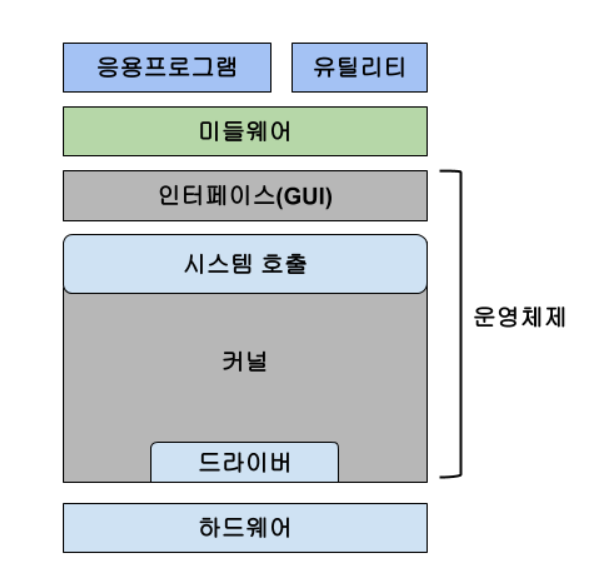
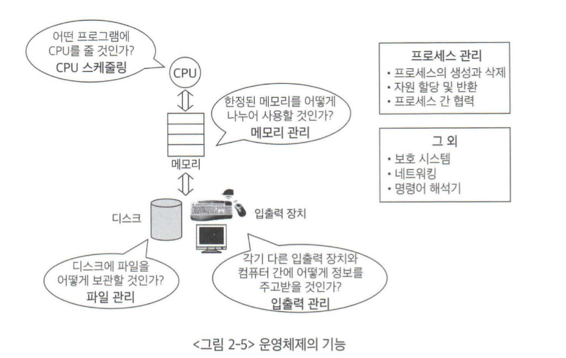
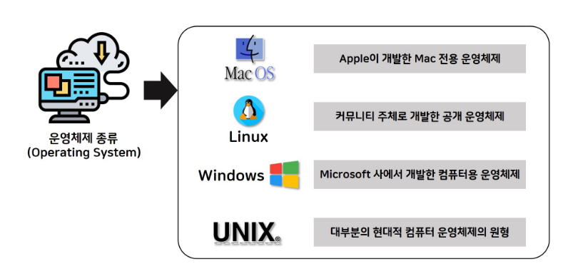

# 🚀 운영 체제

## 1️⃣운영체제 정의 

* **운영체제(Operating System)** :  하드웨어, 시스템 자원(resource)를 제어하고 프로그램에 대한 일반적인 서비스를 지원하는 `시스템 소프트웨어`이다.

    흔히 **시스템(System)**이라는 말은 기반이나 틀을 칭하는 하드웨어를 지칭할 때 쓰이는 말이다. 운영체제를 " Operatinng **System** "이라고 부르는 것은 소프트웨어이지만 하드웨어와 밀접한 관계가 있고, 함께 공존함을 유추할 수 있다. 

   
  
* **커널(Kernel)**  :  메모리에 상주하는 운영체제의 일부분이다. **좁은 의미의 운영체제** 라고도 부른다.

  

   운영체제의 모든 부분을 메모리에 올리는 것은 효율적이지 않다. 가령 복사(유틸리티) 와 같은 기능은 상시 사용하는 것이 아니다. 따라서 핵심적인 부분만 메모리에 상주를 시키고 그것이 커널이다. 

  

   
  
   

## 2️⃣운영체제 기능

1. 사용자에게 편리한 인터페이스를 제공한다.
2. 컴퓨터 시스템 하드웨어 및 소프트웨어 자원을 여러 사용자 간 효율적 할당, 관리, 보호한다.
3. 사용자와 운영체제 자신을 보호한다. 등등...

 운영체제의 대표적인 기능으론 **사용자에게 편리한 환경 제공과 컴퓨터 시스템 내 자원(resource)를 효율적으로 관리하는 것이다.** 운영체제에게는 사용자에게 편리함을 제공하는 것보다는 (?) 컴퓨터 시스템 자원 관리가 더 중요도가 높다고 할 수 있다. 그래서 운영체제를 자원 관리자(resource manager) 라고 부르기도 한다.

[ 운영체제의 자원 관리 기능 ]

 

 

## 3️⃣운영체제 분류

운영체제의 분류 기준으로는...

1. 동시 실행 프로세스 수

2. 동시 사용자 수

3. 작업 처리 방식

**[표1]**

|       분류 기준       |          단일          |         다중          |
| :-------------------: | :--------------------: | :-------------------: |
| 동시 실행 프로세스 수 |   **Single Tasking**   |   **Multi Tasking**   |
|    동시 사용자 수     | **Single-User System** | **Multi-User System** |

**[표2]**

|    분류기준    |       일괄 처리 방식        |       시분할 방식       |    실시간 시스템     |          분산처리 시스템          |
| :------------: | :-------------------------: | :---------------------: | :------------------: | :-------------------------------: |
| 작업 처리 방식 | **Batch Processing System** | **Time Sharing System** | **Real Time System** | **Distributed Processing System** |

 

자세히..

 동시 실행 프로세스 

* **Single Tasking (단일 작업) :**

  + 하나의 프로세스가 끝이 난 후 다른 프로세스 실행.

  + MS DOS

    

* **Multi Tasking (다중 작업) :**

  + 동시에 여러 프로스세스 수행가능.
  + Unix, Linux, Windows ...

 

동시 사용자 수

* **Single User System (단일 사용자) :**

  + 단일 사용자가 모든 시스템 리소스 독점.

  + 자원 관리가 비교적 간단함.

  + Window10, Android, Ms Dos ...

    

* **Multi User System (다중 사용자) :**

  + Multi Tasking 을 지원함
  + 자원관리가 복잡함.
  + 서버, 클러스터(Cluster) 장비(Unix, Linux, Windows server) ...

 

작업 처리방식

* **Batch Processing System (일괄 처리) :**

  + 초창기의 OS.

  + 사용자들의 요청작업들을 모았다 한번에 처리.

  + 생산성이 낮고, 응답시간이 매우 길다.

    

* **Time Sharing Systme (시분할 처리) :**

  + 여러 사용자가 동시에 시스템 자원 사용 가능.

  + 운영체제가 파일 시스템 및 가상메모리 관리.

  + 생산성이 높고, 응답시간이 매우 짧다.

    

* **Real Time System (실시간 처리) :**

  + Hard Real Time System (경성 실시간 시스템) : 

    주어진 시간을 지키지 못할 경우 매우 위험한 결과 초래

    로켓, 원자로 제어 시스템.

  + Soft Real Time System (연성 실시간 시스템) : 

    멀티미디어 스트리밍 시스템과 같이 정해진 시간 단위로 전달 되어야 올바른 기능을 수행할 수 있는 시스템.

    멀티미디어 스트리밍.

  

* **Distributed Processing System (분산 처리) :**

  + 네트워크 기반으로  구축된 병렬 시스템.
  + 물리적으로 분산되어 있고, 통신망으로 상호연결.
  + Cluster System, P2P

 

**💡다중 처리기 시스템 (Multi-Processor System)**

1 개의 컴퓨터 안에 CPU가 여러 개 설치되어 있는 시스템.

 

 

## 4️⃣운영체제 종류

대표적인 범용 운영체제(General Purpose OS) 

* 윈도우 (Window)

  > 1. 마이크로소프트사에서 MS-Dos에 다중작업 기능과 GUI를 추가하여 개발.

   

* 맥OS (Mac OS)

  > 1. 애플의 개인용 컴퓨터인 매킨토시용으로 개발된 운영체제.
  > 2. 윈도우에 비해 권한체계가 엄격하여 보안성 좋음.

   

* 유닉스 (Unix)

  > 1. 1969년 미국 벨(Bell)연구소에서 최초로 개발
  >
  > 2. 유닉스는 프로그램 개발 환경을 위해 설계된 운영체제로 이식성이 좋음.
  >
  > 3. 커널의 크기가 작고,  소스코드가 공개.
  >
  > 4. 하드웨어 기술이나 소프트웨어 기술이 발전 하더라도 확장성을 지원.

   

* 리눅스 (Linux)

  > 1. 1991년 핀란드 헬싱키 대학의 학생 리누스 토발즈에 의해 유닉스 호환 운영체제로 개발.
  >
  > 2. 소스 코드를 공개. 다양한 배포판이 존재함 
  >
  >    (레드햇, 우분투, 데비안, 수세, 젠투)

 

 

 

 

 

 

 

 

---

**[ 참 고 ]**

* [운영체제와 정보기술의 원리(이화여자대학교출판문화원) - 개정판 : 반효경 지음]()
* [쉽게 배우는 운영체제 : 한빛아카데미. 2018]()

+ [위키백과/운영체제](https://ko.wikipedia.org/wiki/%EC%9A%B4%EC%98%81_%EC%B2%B4%EC%A0%9C)
+ [brian_kim.log님 블로그](https://velog.io/@brian_kim/OS-%EC%9A%B4%EC%98%81%EC%B2%B4%EC%A0%9C-%EA%B5%AC%EC%A1%B0%EC%99%80-%EC%9B%90%EB%A6%AC)

