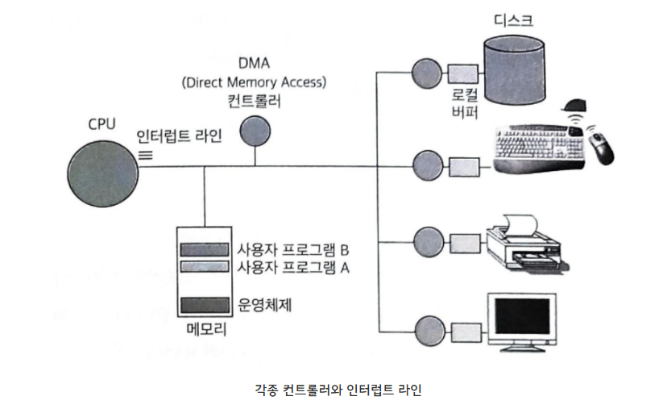
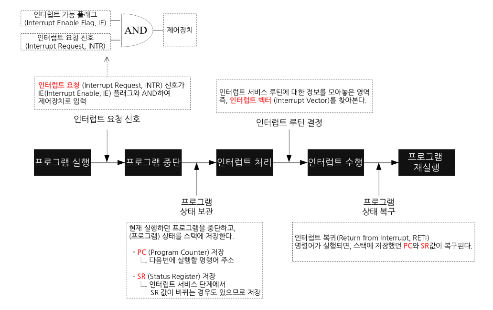
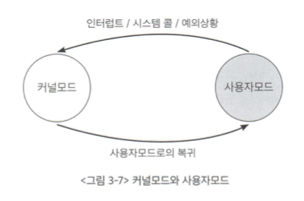
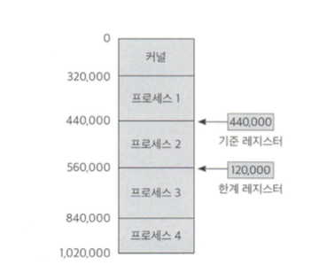

# 🚀 컴퓨터 시스템의 개요

## 1️⃣  컴퓨터 시스템의 구조

컴퓨터는 (I/O)

**외부장치 --> 내부장치 데이터 읽기. ( InPut )**

**내부장치 --- 각종 연산 수행.**

**내부장치 ---> 외부장치 데이터 내보내기. ( OutPut )**

의 과정을 수행 한다.

CPU를 제외한 각 하드웨어 장치에는 **컨트롤러(Controller)**와 **로컬버퍼(Local Buffer)**라는 것이 있다. 

CPU가 각 장치의 로컬버퍼를 일일이 확인하는 것이 아니다.

각 장치의 컨트롤러가 장치의 로컬버퍼를 관리하고 CPU를 필요로 할 때 인터럽트를 발생시키는 것이다.

 

 

## 2️⃣  인터럽트

CPU 는 매시점 메모리에서 명령(Instruction)을 하나씩 읽어 와서 수행. 

다른 장치에 있는 컨트롤러가 CPU서비스가 필요할 때!! 인트럽트 발생!!

 

**인터럽트(Interrupt)** : CPU가 프로그램을 실행하고 있을 때, 입출력 하드웨어등의 장치에서 예외상황이 발생하여 처리가 필요한 경우 CPU에 알려 처리 할 수 있도록 하는 것.

CPU는 명령(Instruction)하나를 수행할 때마다 인트럽트가 발생했는지 확인한다.

​	 

+ 하드웨어 인터럽트 : 

  하드웨어가 발생시키는 인터럽트이다. CPU외부 디스크 컨트롤러나 주변장치로 부터 요구되는 것. (기계검사 인터럽트, 외부인터럽트, 입출력 인터럽트, 프로그램검사 인터럽트)

+ 소프트웨어 인터럽트 (Trap, Exception) : 

  CPU 내부에서 자신이 실행한 명령이나 CPU의 명령 실행에 관련된 모듈이 변환하는 경우 발생.( 잘못된 메모리접근, Division by zero, 시스템 콜 )
  
   

**인터럽트 라인(Interrupt Line)** : CPU옆에 있어서 CPU에 신호를 보냄.

 

**인터럽트 벡터(Interrupt Vector)** : 인트럽트 종류마다 번호를 정해서, 번호에 따라 처리해야할 코드가 위치한 부분(인트럽트 처리 루틴, 인트럽트 핸들러)을 가르키고 있는 자료구조.

 

**인터럽트 핸들링(Interrupt Handling)** : 인터럽트가 발생한 경우 처리해야할 절차.

+  프로세스 제어 블록( Process Control Block : PCB)

인터럽트가 동작 중이던 프로세스의 정보가 CPU의 레지스터에서 지워지게 된다. 그럼 인터럽트 해결 하고 난 후 다시 처음부터 프로세스를 진행해야한다. 이 문제를 해결하기 위해 운영체제는 현재 시스템 내에서 실행되는 프로그램들을 관리하기 위해 **프로세스 제어 블록(PCB**)이라는 자료구조를 둔다. 실행중이던 프로그램의 코드 메모리주소와 레지스터값, 하드웨어 상태 등을 저장한다.

[PCB(Process Controll Block)](http://127.0.0.1:4000/os/os-process/#4%EF%B8%8F%E2%83%A3--%ED%94%84%EB%A1%9C%EC%84%B8%EC%8A%A4%EC%9D%98-%EB%AC%B8%EB%A7%A5) -  프로세스 문맥 교환

 

[ 인터럽트 처리 과정 ]

오늘날의 운영체제는 인트럽트 발생할 때에만 운영체제 코드 부분으로 CPU가 이양되어 인터럽트 처리를 수행하게 된다.  운영체제가 직접 CPU를 점유하는 경우는 인터럽트에 의하지 않고는 발생하지 않음.

 

 

## 3️⃣  입출력 구조

**동기식 입출력( Synchronous I/O )** : 프로그램이 I/O요청을 했을 때,  I/O 작업이 완료되어야 다음 작업을 할 수 있는 방식.

* **진행 순서** 

  1. 사용자 프로그램 I/O 요청 (직접 I/O 불가)

  2. 운영체제의 커널을 통해 Device Controller에게 I/O 요청.

  3. **입출력을 요청한 프로세스(Requesting Process) --> 봉쇄상태(Block State)로 바꾸어 입출력이 완료 될 때까지 CPU를 할당 받지 못하게 한다.**

  4. I/O 작업 완료 후 Device Controller가 CPU에 인터럽트.

  5. 프로세스(Requestin Process)의 봉쇄상태(Block State)를 해제하여 CPU를 할당 받을 수 있는 권한이 생김.

  

  > 💡**Blocking State** : 곧바로 작업을 수행할 수 있는 프로그램에게 CPU를 할당.
  >
  > ​	**Non-Blocking State** : CPU가 입출력 연산이 끝날 때까지 아무 일도 할 수 없음.

  

 

* **단점**

  CPU의 속도 >>>> 외부 장치에서 데이터 읽어오는 속도

  따라서 입출력이 완료될 때 까지 CPU는 아무 일을 하지 못하기 때문에 자원 낭비.

 

 

**비동기식 입출력( Asynchronous I/O )** : 프로그램이 I/O요청을 했을 때, I/O작업을 기다리지 않고 CPU를 다음 작업에 넘겨주는 방식.

* **진행 순서**

  1. 사용자 프로그램 I/O 요청 (직접 I/O 불가)

  2. 운영체제의 커널을 통해 Device Controller에게 I/O 요청.
  3. **요청한 프로세스(Requesting Process)에게 CPU를 곧바로 줘서 다른 작업을 수행한다.**
  4. I/O 작업 완료 후 Device Controller가 CPU에 인터럽트를 건다.
  5. 읽어온 데이터를 필요로 하는 명령을 수행할 수 있게 된다.

 

 

## 4️⃣  DMA

원칙적으로 메모리(Memory)는 CPU에 의해서만 접근할 수 있는 장치이다.

메모리 데이터에 접근하기 위해서는 CPU에 인터럽트를 발생 시켜 이를 대행하게 해야함.

하지만 입출력장치가 메모리접근을 위해서 CPU에 너무 잦은 인터럽트를 발생시키면 CPU의 효율이 떨어짐.

이를 해결하기 위한 것이 **"DMA"**

 

**DMA( Direct Memory Access )** : 메모리 버퍼, 포인터, 카운터를 사용하여 장치 제어기가 CPU도움이 없이 데이터를 직접 메모리로 전송하는 입출력 방식. (하나의 Controller 이다.)

바이트(Byte)단위가 아닌 블록(Block)이라는 큰 단위 정보로 메모리로 읽어온 후 CPU에게 인터럽트. 인터럽트의 빈도를 줄여 CPU가 조금더 효율적으로 움직일 수 있게 함.

 

 

## 5️⃣ 저장장치의 계층구조

**[ 주기억 장치 ]**

휘발성, 빠르다, 비싸다.

**레지스터( Register )** : 컴퓨터에서 제일 빠른 메모리. 프로세서에 위치한 고속 메모리

**캐시 메모리( Cashe Memory )** : 레지스터 다음으로 빠른 메모리, CPU 내부에 존재한다. 가장 자주 사용되는 데이터를 복사해와 CPU의 메모리 접근 시간을 줄여줌. CPU와 주기억장치간의 속도 차이로 인한 성능 저하를 막기 위해 사용.

**메인 메모리( Main Memory )** : CPU에서 직접 전근이 가능한 메모리이다. 캐시에 비하면 훨씬 느리지만 HDD와 SSD에 비하면 훨씬 빠르다.

 

**[ 보조 기억 장치 ]**

비휘발성, 느리다, 싸다.
파일 시스템 용(File System), 스왑 영역(Swap Area)을 제공.

**마그네틱 디스크( Register )** : HDD

**광 디스크( Cashe Memory )** : CD

**마그네틱 테이프( Main Memory )** : 카세트 테이프

 

 

## 6️⃣ 보안

**하드웨어 보안**

운영체제는 기본적으로 

다중 프로그래밍( Multi-Programming ) 환경에서 각 프로그램간의 충돌을 막기 위해

하드웨어적인 보안이 필요하다.

**커널모드(Kernel Mode), 사용자모드(User Mode)**를 지원한다.

 

**커널모드(Kernel Mode)** : 운영체제가 CPU의 제어권을 가지고 운영체제 코드를 실행하는 모드

* 모든 자원(드라이버, 메모리, CPU)에 접근 명령을 내릴 수 있다.
* 다른 프로그램이 메모리 영역이나 파일 영역을 침범을 방지 한다.

 

**사용자모드(User Mode)** : 일반 사용자 프로그램이 실행되고, 제한적인 명령을 수행하는 모드

* 사용자 모드는 직접 시스템에 중요한 영향을 미치는 연산 수행 불가능.( 특권 명령 수행 불가능 )

 

**모드비트(Mode Bit)** : 사실상 사용자 모드에서 시스템에 중요한 명령(특권 명령)을 하면 그만이다. 물리적으로 이를 구분해 줄 하드웨어적인 장치가 필요하다. (사용자모드와 커널모드를 구분해주는 하드웨어적인 장치가 있어야 함.)

그것이 **"모드비트"**이다. 

**모드비트 0 : 커널모드**

**모드비트 1 : 사용자모드**

 

**특권명령** :  시스템 보안과 관련된 명령어들, <u>즉 모드비트가 0 일 때만 수행 가능하다.</u>

예시로는 입출력 명령이 있다. 

사용자프로그램이 디스크에 직접 접근하는 것은 보안상 문제가 있을 수 있다.

따라서 모드비트를 0으로 바꾸고 운영체제가 입출력명령(특권 명령)을 대신 수행하도록 부탁해야한다. (시스템 콜)

 

 

**메모리 보안**

다른 사용자 프로그램이 커널이 위치한 메모리영역에 접근 하려할 수 도 있다. 특히나 인터럽트 벡터와 인터럽트 처리루틴이 있는 곳의 메모리는 더욱이 보안이 철저해야한다.

이를 위해 메모리에 **기준 레지스터(Base Register)**와 **한계 레지스터(Limit Register)**를 두고 있다.

**기준 레지스터(Base Register)** : 프로그램의 시작 주소를 저장.

**한계 레지스터(Limit Register)** : 프로그램의 길이를 저장.

사용자 프로그램은 기준 레지스터에 저장된 시작 주소부터 한계 레지스터에 저장된 주소의 길이 만큼만 접근이 가능하다.  만약 이 범위 밖의 주소를 접근하려하면 예외사항이라는 소프트웨어 인터럽트발생. CPU의 제어권은 운영체제로 옮겨가고, 프로그램은 강제로 종료된다.

기준 레지스터와 한계 레지스터를 사용자 프로그램이 직접 정할 수 있으면 아무 의미가 없음으로 다음 레지스터들의 값을 세팅하는 연산은 특권명령으로 규정되고 있다.

 

 

**CPU 보호**

특정 프로그램이 CPU를 독점하는 것을 막기 위해 **타이머(Timer)**라는 하드웨어를 사용한다.

**타이머(Timer)** : 정해진 시간이 지나고 나면 인터럽트를 발생시켜 운영체제에 CPU 제어권을 넘겨줌. 운영체제는 인터럽트 처리루틴에 의하여 CPU를 다른 프로그램에게 이양시켜줌.

타이머는 매 클럭 틱때마다 1씩감소한다. 타이머가 0이 되는 순간 인터럽트 발생.

**로드 타이머(Load Timer)** : 타이머의 값을 세팅하는 명령. (특권 명령)

 

 

 

 

 

 

 

 

---

**[ 참 고 ]**

* [운영체제와 정보기술의 원리(이화여자대학교출판문화원) - 개정판 : 반효경 지음]()
* [쉽게 배우는 운영체제 : 한빛아카데미. 2018]()

+ [위키백과/운영체제](https://ko.wikipedia.org/wiki/%EC%9A%B4%EC%98%81_%EC%B2%B4%EC%A0%9C)
+ [brian_kim.log님 블로그](https://velog.io/@brian_kim/OS-%EC%9A%B4%EC%98%81%EC%B2%B4%EC%A0%9C-%EA%B5%AC%EC%A1%B0%EC%99%80-%EC%9B%90%EB%A6%AC)

* [경역학도의 좌충우돌 코딩님 블로그](https://whatisthenext.tistory.com/147)