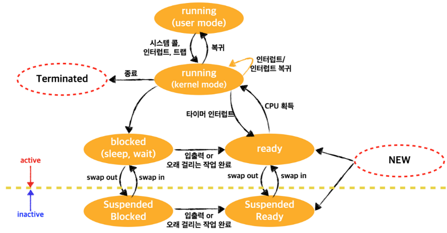
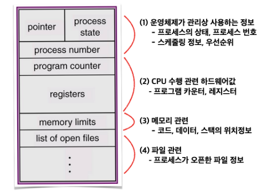

# 🚀 프로세스의 관리

## 1️⃣  프로세스

**프로세스(Process)** : 디스크에서 실행 파일(.exe) 형태로 존재하던 프로그램이 <u>메모리에 올라가서 실행 중인 프로그램</u>이다.

 

 

## 2️⃣  프로세스 상태

> 엄마( 스케줄러 ) : " 나와서 밥(CPU)먹어라!! "
>
> 나 (프로세스) : " 나 게임 중 !!  할 거 없는 형(프로세스) 먼저 줘 ~ "

 밥은 무한리필되는 한 공기... 노잼인 듯ㅋㅋ 

 

**[ 프로세스의 상태 변화도 ]**

 

CPU제어권을 아무 프로세스에게 줄 수 없다. 왜냐하면 CPU제어권을 획득하더라도 입출력을 기다리고 있는 프로세스는 아무런 작업을 수행할 수 없다. 이는 CPU자원의 낭비이다. 따라서 프로세스마다 각자의 상태를 정의할 필요가 있다.

 

| 프로세스 상태                                                | 설명                                                         |
| :----------------------------------------------------------- | :----------------------------------------------------------- |
| **실행(Running)**          | 프로세스가 CPU제어권을 가지고, 명령을 수행 중인 상태.        |
| **준비(Ready)**            | CPU만 보유하면 당장 명령을 수행할 수 있는 상태. (다른 조건 모두 충족) |
| **봉쇄(Blocked, Wait, Sleep)** | CPU제어권을 가지더라도, 명령을 수행할 수 없는 상태.          |
| **시작(New)**              | 프로세스를 위한 각 종 자료구조는 생성되었지만 메모리는 획득하지 못한 상태. |
| **완료(Terminated)**       | 프로세스는 종료되었으나, 운영체제가 그 프로세스와 관련된 자료구조를 정리하지 못한 상태. |

 

 

## 4️⃣  프로세스의 문맥

 **시분할 시스템 환경**에서는 CPU를 한 프로세스가 독점하는 것을 방지하기 위해 Time Interrupt를 이용하여 CPU제어권을 사용자 프로세스에서 빼앗는다. CPU제어권은 커널에게 넘어가며, 커널은 Ready상태의 프로세스에 CPU를 다시 넘겨준다. 그리고 다시 처음의 프로세스가 CPU제어권을 받으면 명령 수행을 재개한다. 

 

>  CPU : " 그런데 내가.. 어디까지 문제를 풀었더라?  프로세스 문맥을 확인해야겠군..."

 

**프로세스의 문맥(Process Context)** : 현재 프로세스의 상태를 정확히 규명하기 위한 정보.

프로세스 문맥은 아래와 같이 크게 <u>3가지</u>로 분류가능하다.

* **하드웨어 문맥 :** CPU의 수행 상태 정보이다. ( Program counter값, 각 종 Register값 )

* **프로세스의 주소 공간 :** 코드/데이터/스택 로 구성된 프로세스의 독자적인 주소 공간 정보이다.

* **커널상의 문맥 :** 커널 또한 코드/데이터/스택 으로 구성된 커널의 독자적인 주소 공간이 있고, 

  커널의 스택공간에 프로세스를 관리하기 위한 자료구조 **PCB(Process Control Block)**를 뜻한다.

 

**프로세스 제어 블록(Process Control Block : PCB)** : 운영체제가 시스템내의 프로세스들을 관리하기 위해 프로세스마다 유지하는 정보들을 담는 커널 내의 자료구조.

* 프로그램의 상태
* 프로그램 카운터
* CPU 레지스터 값
* CPU 스케줄링 정보
* 메모리 관리 정보
* 자원 사용 정보
* 입출력 상태 정보

위의 정보를 담는 자료구조.

 

**문맥교환(Context Switch)** :  현재 프로세스의 문맥을 저장하고 새로운 프로세스의 문맥을 세팅하는 과정.

**사용자모드(프로세스 A) --- 커널모드(Kernel) --- 사용자모드 (프로세스 B)**

 

* **문맥교환이 발생 요인 :** 

  Time Interrupt, System call(I/O)

* **문맥교환의 과정 :**
  1. 프로세스에서 Time Interrupt 및 System call(I/O) 발생.
  2. 사용자 모드에서 커널 모드로 실행 모드 변경. (CPU제어 커널)
  3. 프로세스의 문맥을 PCB에 저장 / 프로세스의 상태가 봉쇄(Blocked)로 변경
  4. 커널이 대기(Ready)상태의 프로세스의 PCB정보를 하드웨에 세팅
  5. 커널모드에서 사용자모드로 실행 모드 변경. (CPU제어 사용자**)**

* **cf. 문맥교환이 아닌 것 :**

  **사용자모드(프로세스 A) --- 커널모드(Kernel) --- 사용자모드 (프로세스 A)**

  Interrupt, System call을 통해 커널모드의 서비스만 받은 후 복귀하는 경우

 

>  💡**오버헤드** :  어떤 일 처리를 위해 간접적으로 들어가는 시간 및 메모리.
>
> 문맥교환중에 일어나는 작업은 실제 시스템에서 오버헤드가 큼.
>
> 따라서 문맥교환이 빈번하게 발생하지 않도록 CPU할당시간(Time Interrupt)를 늘려야하지만
>
> 너무 크게 세팅하면 시분할 시스템의 의미가 사라진다.

 

 

## 5️⃣ 프로세스 스케줄링

 

 

 

 

 

 

 

 

 

 

---

**[ 참 고 ]**

* [운영체제와 정보기술의 원리(이화여자대학교출판문화원) - 개정판 : 반효경 지음]()
* [장장스님의 블로그](https://zangzangs.tistory.com/108)
